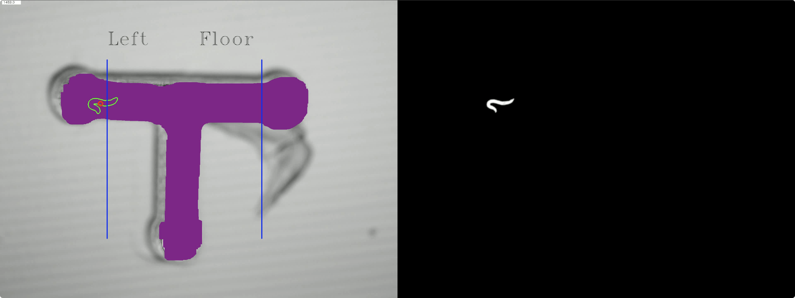
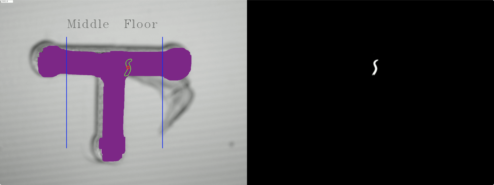
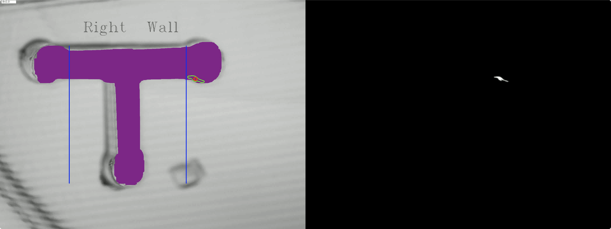
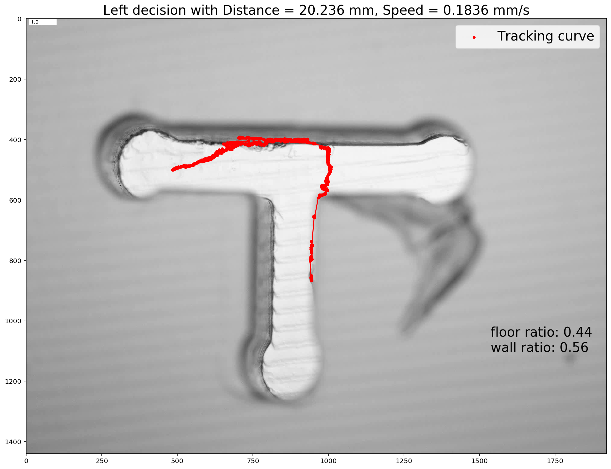
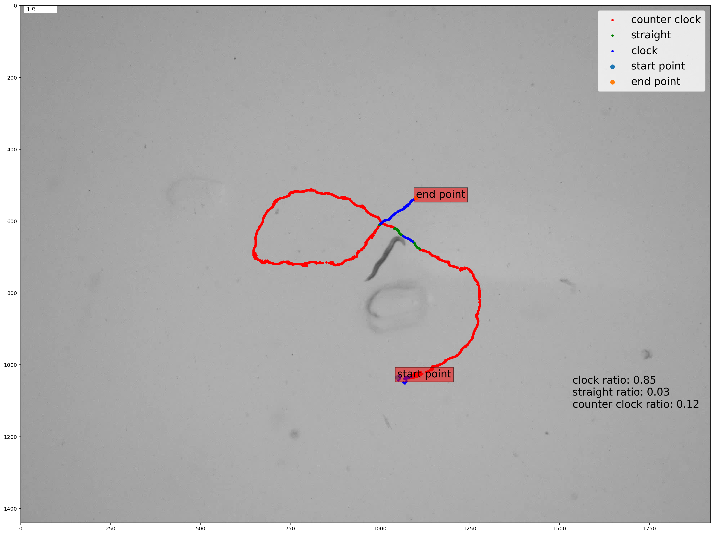
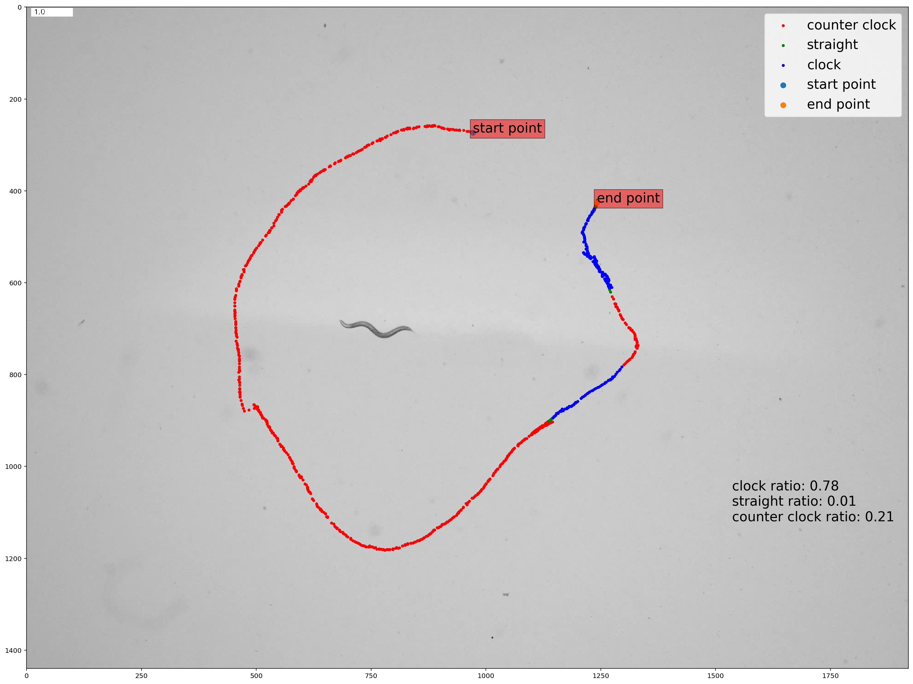

## Worm_Tracker
This is a worm tracker used in Dr. Gourgou's research project. For more details, please visit:  
[Spatial learning, navigation and decision-making in  C. elegans ](https://elenigourgou.engin.umich.edu/research/)
## Requirement
--Python 3 
--Numpy  
--Scipy 
--Matplotlib 
--Opencv  
## How to run
### If tracking a worm inside a T-maze
`/bin/bash python3 worm_tracker.py --input_dir[your video directory] --H[video height] --W[video width]`
### If tracking a worm on an opensurface, i.e. the clockwise / counter clockwise detection
`/bin/bash python3 worm_tracker.py --input_dir[your video directory] --H[video height] --W[video width] --is_clock`
### If using IDE
You can change the command line in `run_my_code.sh` and run it in your IDE.

## Results
### Tracking a worm inside a T-maze
The tracker will generate a tracking video and a summary plot for each input video, some sample frames of the tracking video and a sample summary plot are shown below:
#### The worm is on the left side of the T-maze, and it's moving along the floor.

#### The worm is in the middle of the T-maze, and it's moving along the floor.

#### The worm is on the right side of the T-maze, and it's moving along the wall.

#### Summary plot

### Tracking a worm on an opensurface
#### Summary plot 1

#### Summary plot 2

## Feel free to change parameters and give feedbacks!
